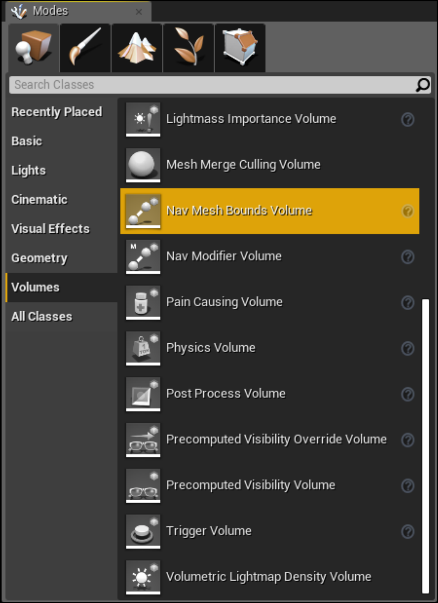

# 生成导航网格

在Unreal中生成一个简单的导航网格非常简单。让我们看看该怎么做。在**模式**面板中，进入**体积**选项卡，你将找到**导航网格边界体积**，如下面的截图所示：

<figure><figcaption></figcaption></figure>

将其拖入世界。你会注意到，相对于地图，这个体积非常小。该体积内的所有内容都将被考虑以生成一个 Nav Mesh。当然，Nav Mesh 有许多参数，但暂时让我们保持简单。 如果你按下键盘上的 P 键，你将能够在视口中看到 Nav Mesh，如下面的截图所示：

<figure><figcaption></figcaption></figure>

正如你所看到的，它仅限于包含在**Nav Mesh Bounds Volume**体积内的区域。让我们缩放**Nav Mesh Bounds Volume**以适应我们所有的关卡。这就是你的关卡应该看起来的样子：

<figure><figcaption></figcaption></figure>

你是否注意到，当你缩放体积时，导航网格会自动更新？这是因为，在Unreal中，每次影响Nav Mesh的事情发生时，都会生成Nav Mesh。


更新时，受影响的Nav Mesh部分（即更新的部分）应变为红色，如下面的截图所示：

.png>)


这是生成Nav Mesh的简单方法。然而，要掌握该工具，我们需要更多地了解如何优化Nav Mesh以及AI如何使用它。
