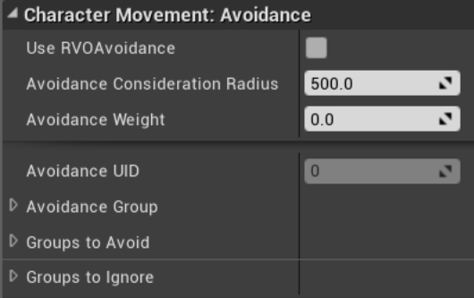

# 互惠速度障碍物（RVO）

互惠速度障碍物（RVO）算法由三位研究人员Jur van den Berg、Ming C. Lin和Dinesh Manocha于2008年在他们的论文《实时多智能体导航的互惠速度障碍物》中发现。

RVO算法与路径无关，这意味着它不知道智能体正在遵循的路径，也不知道智能体正在导航的导航网格。此外，每个智能体独立导航，无需显式通信。因此，即使对于大量智能体，RVO运行速度也非常快，并且如果传入碰撞的数量有限，它提供了足够真实的行为。&#x20;

**虚幻引擎中的RVO**

在虚幻引擎中实现RVO算法可以追溯到虚幻开发套件（UDK）（UE3）。在UE4中，您可以在角色移动组件内找到实现的算法。&#x20;

要在特定角色上激活RVO，请打开其角色移动组件并导航到角色移动：避障部分。在这里，您可以打开算法并设置一些设置，如下图所示：

<figure><figcaption></figcaption></figure>

以下设置可用（您需要点击底部的小箭头以展开所有设置）：&#x20;

* 使用RVO避免：指定是否在此角色上使用RVO算法。
* 避免考虑半径：RVO算法只考虑在此半径内的障碍物。因此，如果在此半径内没有任何障碍物，RVO将不会改变角色的行进路线。另一方面，如果在此半径内有障碍物（例如其他角色），RVO将尝试避开它们。此参数非常重要，需要在启用RVO时根据角色遇到的障碍物类型进行适当调整。
* 避免权重：这表示RVO需要在避免障碍物方面介入的程度。实际上，算法会尝试在角色前进的方向和避开障碍物的方向之间取平均值。这是RVO算法的力量所在，并决定了其行为。默认值为0.5，在大多数情况下都能正常工作。
* 避免UID：这是使用RVO时自动生成的识别号（您无法设置）。当您想与避免管理器交互时，此编号很重要（有关更多信息，请参阅C++中的RVO部分）。
* 避免组：这表示此角色属于哪些避免组。
* 要避免的组：这表示此角色需要避开哪些避免组。
* 要忽略的组：这表示此角色需要忽略哪些避免组，从而在执行RVO避免时不考虑它们。


在多人游戏中，RVO算法仅在服务器上运行。


这些足以让您在游戏中使用该算法并将其用于生产。然而，如果您好奇并想深入了解，请继续阅读下一小节。&#x20;

**高级RVO设置**

本节分为两部分：我们可以在蓝图中做什么，以及我们可以在C++中做什么。

**蓝图中的RVO**

如果你有一个对角色组件的引用，你会发现你可以读取它的所有变量（所有的Get函数都在这里），但你不能设置它们（没有Set函数），如下图所示：&#x20;

<figure><figcaption></figcaption></figure>

看起来在蓝图中你不能在游戏过程中随意打开和关闭RVO，但这不是真的。实际上，仍然可以在实时（游戏时间）稍微改变RVO设置。特别是，你可以使用以下节点来改变RVO是否运行：

<figure><figcaption></figcaption></figure>


无法直接编辑布尔变量的原因很明显，如果你看C++实现，角色需要注册到RVO管理器。实际上，这可能是第一次开启RVO，所有初始化（例如，注册到RVO管理器）都需要处理。


此外，您还可以通过使用以下两个节点更改角色所属的避让组以及应该避免的组：&#x20;

<figure><figcaption></figcaption></figure>

除了这三个功能，你在实时使用RVO时可做的事情相当有限，但C++解锁了新的可能性。

**C++中的RVO**

当然，每次你在虚幻引擎中进入C++领域时，你能做的事情的可能性就会变得非常广泛。在这一部分，我们将探讨其中的一些可能性。&#x20;

首先，你将能够直接访问UAvoidanceManager，它存储了所有使用RVO的代理的数据。&#x20;

从角色移动组件的引用中，你可以检索Avoidance UID，它可以用来查询避免管理器以获取FNavAvoidanceData结构，该结构保存了角色的特定避免数据。除了访问结构中的数据外，你还可以使用它来进一步查询避免管理器以获得更多详细信息。&#x20;

假设你想进行手动速度规划。你可以使用GetAvoidanceVelocity()函数获得当前速度。&#x20;

然而，了解所有可能性的最佳方法是查看源代码。特别是，你需要查看以下文件： Runtime/Engine/Classes/AI/Navigation/AvoidanceManager.h。&#x20;

**RVO观察**

以下是我使用这种方法的一些观察：&#x20;

* 由于它是路径和导航网格无关的，代理可能会被推离导航网格。这意味着你需要考虑这种可能性（以及这种情况发生的频率，例如，如果你的地图有墙壁边界，那么角色不能被推离导航网格）。
* 如果你想让RVO在非角色演员上工作，那么你需要自己重新实现RVO算法（或调整你的演员以使用角色移动组件）。
* 如果在一个非常狭窄的空间里有很多角色，RVO可能无法很好地工作（例如，不现实的行为，如横向滑动）。
* 如果避免考虑半径很高，角色需要在其他角色之间定位自己，那么角色可能会很难找到合适的位置（从而导致奇怪、怪异和不自然的行为）。&#x20;
* 即使许多角色在同一层运行RVO，RVO也非常快。事实上，如果没有障碍物，开销成本几乎为零，因此通过使用适当的避免考虑半径，可以毫无问题地处理许多角色。、
* 你可以实现RVO算法的鼻祖，即VO，它是没有加权的RVO。如果性能真的是一个关注点，它甚至会更快，但真实性会降低。你可以通过查看下一节中的参考资料来了解更多关于这方面的信息。例如，通过修改引擎源代码中的避让管理器，你将能够轻松实现这个算法（或任何其他你选择的东西）。

**RVO资源**

以下是一些你可以查看的进一步RVO资源：

* 原始RVO论文可在以下链接获取：http://gamma.cs.unc.edu/RVO/icra2008.pdf
* 关于RVO的更多信息来自创作者：http://gamma.cs.unc.edu/RVO
* RVO版本2（在虚幻引擎中实现的版本）：http://gamma.cs.unc.edu/RVO2/
