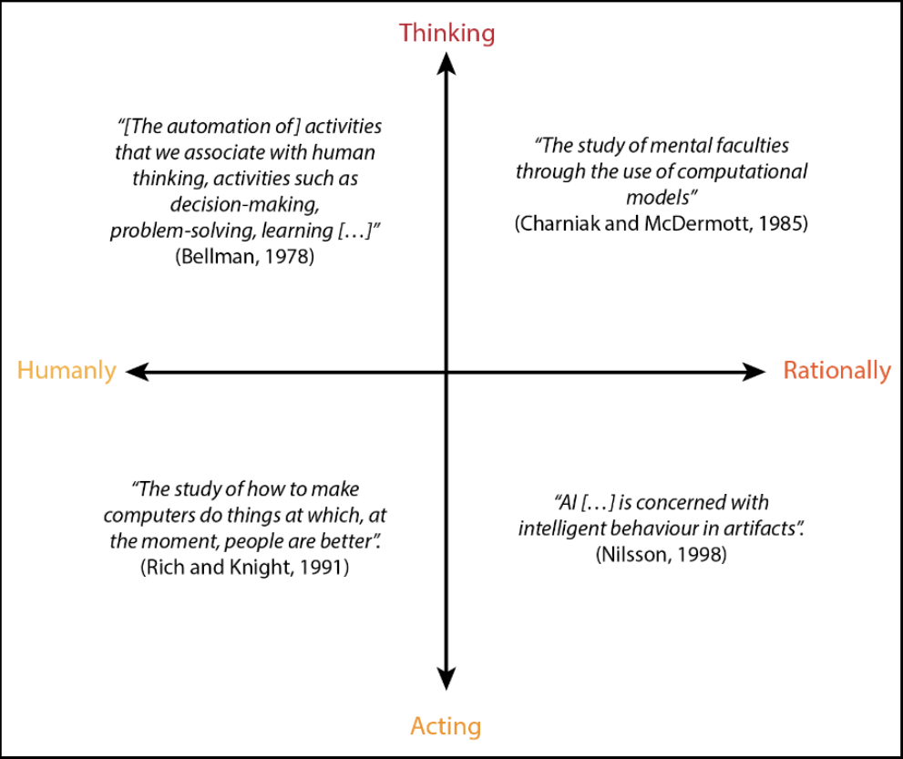

# 历史概述

在开始我们的旅程之前，我认为对AI和游戏AI的历史有一个大致的了解可能会有所帮助。当然，如果你是一个更注重实践的人，迫不及待地想要开始编程AI，你可以跳过这部分。

**什么是AI？**

这是一个非常有趣的问题，没有唯一的答案。事实上，不同的答案引导我们进入AI的不同方面。让我们来看看一些（很多）学者给出的定义（按时间顺序）。

实际上，Russell 和 Norvig 在他们的书中将这些具体的定义组织成了四个类别。这是他们的框架：

<figure><figcaption>
Russell 和 Norvig 的四个类别：左上角是“像人类一样思考的系统”，右上角是“理性思考的系统”，左下角是“像人类一样行动的系统”，右下角是“理性行动的系统”。
</figcaption></figure>

我们没有时间详细讨论“什么是 AI？”这个问题，因为这可以自成一本书。不过，这本书的最后一章也会包括一些哲学参考，你可以在这里扩展你对这个主题的知识。

**回顾过去**

可能让一些人意外的是，AI 的故事远在计算机出现之前就已经开始了。事实上，甚至古代的希腊人就已经假设了智能机器的存在。一个著名的例子是青铜巨人塔洛斯，他保护了克里特岛免受入侵者的侵害。另一个例子是赫菲斯托斯的金色助手，他们在火山锻炉中与独眼巨人一起帮助众神。在 17 世纪，René Descartes 写下了关于能够思考的自动机的文章，并认为动物与机器不同，机器可以通过滑轮、活塞和凸轮来复制。

然而，这个故事的核心始于1931年，当时奥地利逻辑学家、数学家和哲学家库尔特·哥德尔证明了所有一阶逻辑中的真陈述都是可推导的。另一方面，这对于高阶逻辑并不成立，其中一些真（或假）陈述是无法证明的。这使得一阶逻辑成为自动化推导逻辑后果的良好候选者。听起来很复杂吗？那么你可以想象这对他的传统主义同时代人的耳朵来说是怎样的。

<figure><figcaption></figcaption></figure>

1937年，英国计算机科学家、数学家、逻辑学家、密码学家、哲学家和理论生物学家艾伦·图灵指出了“智能机器”的一些局限性，即停机问题：除非程序实际运行，否则无法预先判断它是否会终止。这在理论计算机科学中有许多影响。然而，根本性的步骤发生在十三年后的1950年，当时艾伦·图灵撰写了他的著名论文“计算机器和智慧”，在其中他谈到了模仿游戏，现在通常被称为“图灵测试”：一种定义智能机器的方式。

在20世纪40年代，人们曾尝试模仿生物系统：1943年，McCulloch和Pitts提出了一个神经元的数学模型，1951年，Marvin Minsky创建了一台能够模拟40个神经元并使用3000个真空管的机器。然而，这些努力最终陷入了困境。

从20世纪50年代末到80年代初，人工智能（AI）研究的大部分都致力于“符号系统”。这些系统基于两个组成部分：由符号组成的知识库，以及使用逻辑推理操作这些符号的推理算法，以便扩展知识库本身。

在此期间，许多杰出的头脑取得了显著的进步。值得引用的一位人物是麦卡锡，他在1956年在达特茅斯学院组织了一次会议，首次提出了“人工智能”这个词。两年后，他发明了高级编程语言LISP，其中编写了首批能够自我修改的程序。其他显著的成果包括1959年的Gelernter的几何定理证明器，1961年的Newell和Simon的通用问题求解器（GPS），以及1966年能够进行自然语言对话的著名聊天机器人Eliza。最后，符号系统的巅峰出现在1972年，法国科学家Alain Colmerauer发明了PROLOG。

符号系统催生了许多仍然在游戏等领域使用的AI技术，如黑板架构、路径查找、决策树、状态机和操控算法，我们将在本书中详细探讨所有这些技术。

这些系统的权衡在于知识与搜索之间。你拥有的知识越多，你需要搜索的就越少，搜索的速度就越快，你需要的知识也就越少。这一观点在1997年被Wolpert和Macready以数学方式证明。我们将在本书后面更详细地探讨这种权衡。

在20世纪90年代初，符号系统变得不合时宜，因为它们难以扩展到更大的问题上。此外，一些哲学观点反对它们，认为符号系统是有机智能的不兼容模型。因此，旧的和新的技术被开发出来，这些技术受到了生物学的启发。旧的神经网络被重新启用，1986年Nettalk的成功，一个能够学会大声阅读的程序，以及同年Rumelhart和McClelland出版的《并行分布处理》一书，都使得这些技术得以复苏。实际上，“反向传播”算法被重新发现，因为它们允许神经网络（NN）真正学习。

在过去的30年里，人工智能研究走上了新的方向。从Pearl关于“智能系统中的概率推理”的工作开始，概率被采纳为处理不确定性的主要工具之一。因此，人工智能开始使用许多统计技术，如贝叶斯网络、支持向量机（SVMs）、高斯过程以及广泛用于表示系统状态时间演变的马尔可夫隐藏模型。此外，大型数据库的引入为人工智能解锁了许多可能性，并催生了一个全新的分支——“深度学习”。

然而，重要的是要记住，即使人工智能研究人员发现新的和更先进的技术，旧的也不能被抛弃。事实上，我们会看到，根据问题和其规模，特定的算法可以大放异彩。

**游戏中的AI**

视频游戏中的人工智能历史与我们在前一节中讨论的内容一样有趣。我们没有时间详细分析每一个游戏以及它们如何为这个领域做出贡献。对于最好奇的读者，在这本书的末尾，你会发现其他讲座、视频和书籍，你可以更深入地了解游戏中人工智能的历史。

视频游戏中人工智能的最初形式是基础性的，用于像Pong（雅达利，1972年）、Space Invaders（Midway Games West, Inc.，1978年）等游戏中。实际上，除了移动球拍试图接住球或移动外星人向玩家靠近外，我们无法做更多的事情：

<figure><figcaption>
1978年Midway Games West, Inc.的《太空侵略者》截图，其中使用了基础形式的AI来控制外星人
</figcaption></figure>

第一个使用显著AI的著名游戏是《吃豆人》\[Midway Games West, Inc.,1979]。四个怪物（后来由于Atari 2600的闪烁端口被称为鬼）使用有限状态机（FSM）来追逐（或逃离）玩家：

<figure><figcaption></figcaption></figure>

在20世纪80年代，游戏中的AI并没有太大变化。直到《魔兽争霸：人类与兽人》\[暴雪娱乐，1994]的推出，视频游戏中才成功实现了路径查找系统。我们将在第三章“导航”中探讨《虚幻》中的导航系统：

<figure><figcaption>
这是《魔兽争霸：人类与兽人》[暴雪娱乐，1994]的截图，其中的单位（此截图中的兽人平民和士兵）使用路径查找算法在地图中移动。
</figcaption></figure>

这段文字可能的意思是：

可能是开始让人们关注人工智能的游戏是《**Goldeneye 007**》\[Rare Ltd., 1997]，这款游戏展示了人工智能如何提升游戏体验。尽管它仍然依赖于有限状态机（FSMs），但其创新之处在于角色可以相互看到并做出相应的反应。我们将在第5章“代理意识”中探讨代理意识。这在当时是一个热门话题，一些游戏将其作为主要的游戏机制，例如《**Thief: The Dark Project**》\[Looking Glass Studios, Inc., 1998]：

<figure><figcaption>
来自《Goldeneye 007》[Rare Ltd., 1997]的截图，这款游戏改变了人们对电子游戏人工智能的认知
</figcaption></figure>

以及《**Metal Gear Solid**》\[Konami Corporation, 1998]：

<figure><figcaption>
来自《Metal Gear Solid》[Konami Corporation, 1998]的截图
</figcaption></figure>

另一个热门话题是模拟士兵在战斗中的情绪。首批实现情绪模型的游戏之一是《**战锤：暗之曙光**》\[Mindscape, 1998]，但只有《**幕府将军：全面战争**》\[The Creative Assembly, 2000]才能在这些模型的使用上取得了极大的成功，大量士兵没有出现性能问题：

<figure><figcaption>
这是《战锤：暗之曙光》的截图，这是首批为士兵使用情绪模型的游戏之一。
</figcaption></figure>

<figure><figcaption>
这是《幕府将军：全面战争》的截图。士兵的情绪模型比《战锤：暗之曙光》中的更复杂，但它成功地用于大量士兵。
</figcaption></figure>

一些游戏甚至将AI作为游戏玩法的核心。尽管《**Creatures**》\[Cyberlife Technology Ltd., 1997]是最早这样做的游戏之一，但这个概念在《**The Sims**》\[Maxis Software, Inc., 2000]或《**Black and White**》\[Lionhead Studios Ltd., 2001]等游戏中更为明显：

<figure><figcaption>
《The Sims》的截图。一个模拟角色（角色）正在烹饪，这是游戏中由AI设计的复杂行为的一部分。
</figcaption></figure>

在过去的20年里，许多AI技术被采用和/或开发。然而，如果游戏不需要高级AI，你可能会发现仍然广泛使用的有限状态机（FSMs），以及我们将在第2章“行为树和黑板”中开始探索的行为树。

**游戏中的AI——业界与学术界**

当谈到比较应用于视频游戏的AI时，无论是学术界还是业界，都存在很大的差异。我可以说两者之间几乎发生了争斗。让我们看看这背后的原因。事实上，它们的目标非常不同。

学术界希望为游戏创建能够智能思考并在环境中行动并与玩家互动的AI代理。

另一方面，游戏行业希望为游戏创建**看起来智能思考**并在环境中行动并与玩家互动的AI代理。

我们可以清楚地看到，前者导致**更真实的AI**，而后者导致**更可信的AI**。当然，商业游戏更关注后者，而不是前者。

我们将在第14章“超越”中更详细地探讨这个概念，届时我们将讨论创建游戏AI系统所涉及的心理学和游戏设计。实际上，要实现可信的行为，你往往也需要尽可能地做到真实。

然而，更正式地说，我们可以将游戏AI归类为弱AI（与强AI相对），它侧重于智能地解决特定任务或问题，而不是在其背后发展出意识。无论如何，我们不会进一步深入探讨这个问题。
